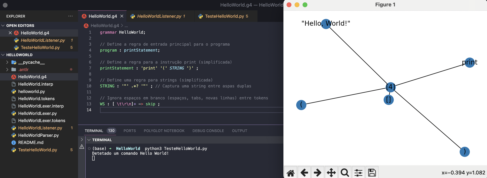

<h1 align="center">
    
</h1>

ANTLR com Python

# TESTE com ANTLR e Python
    

📌 ANTLR com Python: Hello World e Visualização da Árvore de Análise
------------------
Este guia descreve como criar, analisar e visualizar uma árvore de análise para uma gramática simples de "Hello World" utilizando ANTLR para gerar os analisadores e Python para executar a análise e a visualização.

Este guia passo a passo descreve como criar uma simples gramática Hello World usando ANTLR, gerar o analisador em Python, e visualizar a árvore de análise sintática utilizando networkx e matplotlib.

## Pré-requisitos

- Java (para executar o ANTLR).
- ANTLR4 (baixe `antlr-4.x-complete.jar` do [site oficial do ANTLR](https://www.antlr.org/)).
- Python 3.
- Bibliotecas Python: `antlr4-python3-runtime`, `networkx`, `matplotlib`.

## Passo a Passo

Codigo HelloWorld.py

### 1. Criar a Gramática ANTLR

Definimos a gramática no arquivo `HelloWorld.g4`:
 
## 2. Gerar os Ficheiros Python com ANTLR

Utilizamos o seguinte comando para gerar os analisadores léxico e sintático em Python a partir da nossa gramática:

<pre>java -jar /caminho/para/antlr-4.x-complete.jar -Dlanguage=Python3 HelloWorld.g4 </pre>

Certifique-se de substituir /caminho/para/antlr-4.x-complete.jar pelo caminho real onde o arquivo antlr-4.x-complete.jar está localizado no seu sistema.

## 3. Preparar o Ambiente Python

Instalamos as bibliotecas Python necessárias:

<pre> pip install antlr4-python3-runtime networkx matplotlib </pre>

## 4. Escrever e executar o Script de Teste em Python

TesteHelloWorld.py (Esta todo comentado). Este script carrega a entrada print("Hello, World!"), executa a análise sintática, e visualiza a árvore de análise resultante.

<pre> python3 TesteHelloWorld.py </pre>

Deve aparecer a mensagem "Detetado um comando Hello World!" impressa no console, seguida pela visualização da árvore de análise sintática

Video: [https://youtu.be/dwi4CDZWNkM](https://youtu.be/dwi4CDZWNkM)

O projeto foi feito em Python com ANTLR

The project was done with Python with ANTLR

🔧 Tecnologias utilizadas:
------------------

- Python
- ANTLR 
- VS code

💬 Fale comigo
------------------
[*Entre em contato comigo*](https://www.linkedin.com/in/ivo-baptista-3712144/)

